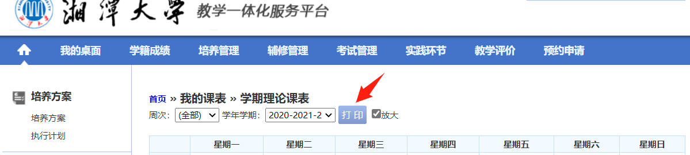

# 从湘潭大学教务系统中导出 ics 课表

---

## 为啥会有这个仓库

因为我想在我的 Windows 上自带的日历上显示课表信息，可能这个需求比较水，但我就是想写:sweat_smile:。拱拱虽然也能查看课表，并且还挺好的，能够导出课表图片，但是它无法导出 ics 之类的，能够可以用来同步多个设备以便查看，但是正经人顺手掏出一个手机，谁还会在电脑上看呢:flushed:。

## 如何使用

1. 进入 [湘大教务系统](http://jwxt.xtu.edu.cn/jsxsd/) 登录，点击课表查询，完成后截图如下

2. 点击 `打印` 按钮即可，保存至本地
3. 下载仓库的代码
4. 打开 `iCalendar.py`，修改xls文件名为刚刚从教务系统上下载的文件的名字，运行程序即可看到结果
5. `iCalendar.ics` 即为最终结果，完

## TODO:
- [ ] 冬夏季事件表不同
- [x] 网上课程节数问题
- [ ] ...

## 写在最后

因为我是通过 `我的课表->学期理论课表` 里下载 xls 文件，然后通过 python 脚本转化为 ics，这种方法挺麻烦的。我尝试过分析网页数据请求的过程，但是不想其他学校那样发送 json 数据，而是一个 document 类型的数据包，囿于自己对这方面技术的不足，待我学习后，再做打算（挖坑）。欢迎同学们自己修改代码和提意见。